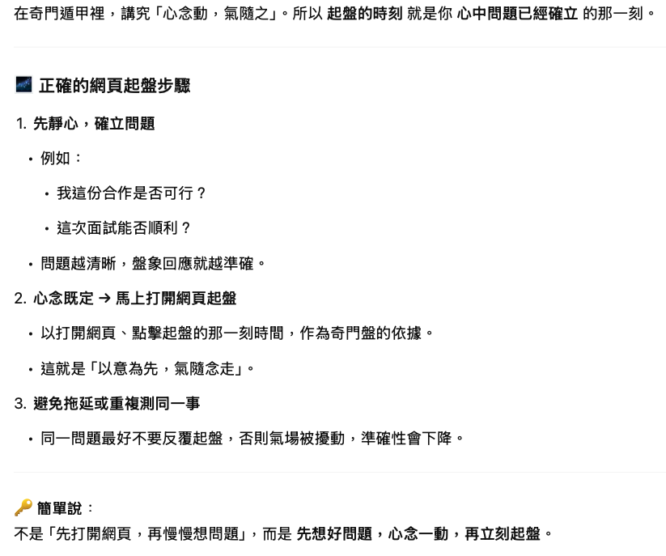

# 奇門遁甲排盤系統

一個基於 Node.js 的奇門遁甲排盤系統，遵循茅山派奇門遁甲排盤方法，支援繁簡體中文和 AI 智能解盤功能。

是先想好問題 再開網頁
https://qi.david888.com


**致謝原作者**：本專案基於 [qfdk/qimen](https://github.com/qfdk/qimen) 進行開發和改進。

## 功能特點

### 🔮 核心功能
- **實時排盤**：根據當前時間自動計算奇門盤
- **自定義排盤**：可選擇任意日期時間進行奇門排盤
- **多種排盤方法**：支援時家、日家、月家、年家奇門
- **多用途分析**：綜合、事業、財運、感情、健康等不同用途
- **時間精度模式**：
  - **傳統模式**：以當下時辰起盤（兩小時一盤）
  - **進階模式**：九宮拆補（13分鐘法），每時辰細分為9段

### 🤖 AI 智能解盤
- **AI 大師解盤**：使用大語言模型進行智能解讀
- **互動問答**：針對排盤結果提出具體問題
- **多模型支援**：支援 OpenAI、Claude、Groq、通義千問、本地 Ollama 等 [更詳細說明](LLM-INTEGRATION.md)
- **個性化分析**：根據不同用途提供專門建議

### 🌏 多語言支援
- **繁體中文**（預設）
- **簡體中文**
- **語言切換**：一鍵切換介面語言

### 📊 完整信息展示
- **基本資訊**：局數（陰陽遁、上中下元）、四柱、旬首
- **九宮分析**：八門、九星、八神分布
- **地盤資訊**：地支、三奇六儀
- **值符值使**：詳細位置和影響分析
- **吉凶判斷**：各宮位吉凶標記和詳細說明

### 🎨 用戶體驗
- **響應式設計**：適配桌面和手機設備
- **直觀界面**：圖形化九宮格顯示
- **顏色標記**：五行顏色和吉凶標示
- **詳細說明**：包含奇門遁甲基礎知識

## 安裝使用

### 環境要求
- Node.js 14+ 
- pnpm 或 npm

### 快速開始
```bash
# 克隆專案
git clone <repository-url>
cd qimen

# 安裝依賴
pnpm install

# 配置環境變數（可選，用於 AI 功能）
cp .env.example .env
# 編輯 .env 文件，設置 LLM API Key

# 啟動應用
pnpm start
# 或
node app.js

# 訪問應用
# 打開瀏覽器訪問 http://localhost:3000
```

### AI 功能配置

#### OpenAI 配置
```env
LLM_PROVIDER=openai
LLM_API_KEY=sk-xxxxxxxxxxxxxxxxxxxxxxxxxxxxxxxxxxxxxxxx
LLM_MODEL=gpt-4o-mini
```

#### 本地 Ollama 配置（免費）
```env
LLM_PROVIDER=ollama
LLM_API_KEY=not_required
LLM_MODEL=llama3.1:latest
LLM_BASE_URL=http://localhost:11434/v1
```

#### Groq 配置（高速推理）

```env
LLM_PROVIDER=groq
LLM_API_KEY=gsk_xxxxxxxxxxxxxxxxxxxxxxxxxxxxxxxxxxxxxxxx
LLM_MODEL=mixtral-8x7b-32768
```

## 技術架構

### 後端技術
- **Express.js**：Web 框架
- **lunar-javascript**：農曆和節氣計算
- **EJS**：模板引擎
- **多語言支援**：自建 i18n 系統

### AI 整合
- **LLM 服務**：統一的多提供商接口
- **智能提示詞**：結構化奇門數據轉換
- **錯誤處理**：優雅降級和備用分析

### 前端技術
- **Bootstrap**：響應式 UI 框架
- **jQuery**：DOM 操作和 AJAX
- **CSS3**：現代樣式和動畫

## API 接口

- `GET /`：主頁面（實時排盤）
- `GET /custom`：自定義排盤
- `POST /api/llm-analysis`：AI 解盤分析
- `GET /api/llm-config`：LLM 配置狀態
- `GET /api/llm-test`：測試 LLM 連接

## 專案結構

```
qimen/
├── app.js                 # 主應用程序
├── lib/                   # 核心庫
│   ├── qimen.js          # 奇門遁甲計算引擎
│   ├── llm-analysis.js   # AI 解盤服務
│   ├── i18n.js           # 多語言系統
│   └── constants.js      # 常量定義
├── views/                 # 模板文件
├── public/               # 靜態資源
├── lang/                 # 語言文件
└── docs/                 # 文檔
```

---

# Qimen Dunjia Divination System

A Node.js-based Qimen Dunjia divination system following the Maoshan school methodology, with Traditional/Simplified Chinese support and AI-powered analysis.

**Credits**: This project is developed based on [qfdk/qimen](https://github.com/qfdk/qimen).

## Features

### 🔮 Core Functions
- **Real-time Divination**: Automatic calculation based on current time
- **Custom Divination**: Choose any date and time for divination
- **Multiple Methods**: Support for Shijia, Rijia, Yuejia, Nianjia Qimen
- **Multi-purpose Analysis**: General, career, wealth, love, health consultations

### 🤖 AI-Powered Analysis
- **AI Master Reading**: Intelligent interpretation using Large Language Models
- **Interactive Q&A**: Ask specific questions about divination results
- **Multiple AI Models**: Support for OpenAI, Claude, Groq, Qwen, local Ollama
- **Personalized Analysis**: Tailored advice for different purposes

### 🌏 Multi-language Support
- **Traditional Chinese** (default)
- **Simplified Chinese**
- **Language Toggle**: One-click interface switching

### 📊 Comprehensive Display
- **Basic Info**: Bureau numbers, Four Pillars, Xun Shou
- **Nine Palaces**: Eight Gates, Nine Stars, Eight Spirits distribution
- **Earth Plate**: Earthly Branches, Three Wonders and Six Instruments
- **Zhifu Zhishi**: Detailed position and influence analysis
- **Fortune Assessment**: Palace-wise fortune marking and explanations

### 🎨 User Experience
- **Responsive Design**: Desktop and mobile compatibility
- **Intuitive Interface**: Graphical nine-palace grid display
- **Color Coding**: Five-element colors and fortune indicators
- **Detailed Guide**: Qimen Dunjia fundamentals included

## Installation

### Requirements
- Node.js 14+
- pnpm or npm

### Quick Start
```bash
# Clone the project
git clone <repository-url>
cd qimen

# Install dependencies
pnpm install

# Configure environment (optional, for AI features)
cp .env.example .env
# Edit .env file to set LLM API Key

# Start the application
pnpm start
# or
node app.js

# Access the application
# Open browser and visit http://localhost:3000
```

### AI Configuration

#### OpenAI Setup
```env
LLM_PROVIDER=openai
LLM_API_KEY=sk-xxxxxxxxxxxxxxxxxxxxxxxxxxxxxxxxxxxxxxxx
LLM_MODEL=gpt-4o-mini
```

#### Local Ollama Setup (Free)
```env
LLM_PROVIDER=ollama
LLM_API_KEY=not_required
LLM_MODEL=llama3.1:latest
LLM_BASE_URL=http://localhost:11434/v1
```

#### Groq Setup (High-speed Inference)

```env
LLM_PROVIDER=groq
LLM_API_KEY=gsk_xxxxxxxxxxxxxxxxxxxxxxxxxxxxxxxxxxxxxxxx
LLM_MODEL=mixtral-8x7b-32768
```

## Technical Stack

### Backend
- **Express.js**: Web framework
- **lunar-javascript**: Lunar calendar and solar terms calculation
- **EJS**: Template engine
- **i18n System**: Custom multilingual support

### AI Integration
- **LLM Service**: Unified multi-provider interface
- **Smart Prompts**: Structured Qimen data conversion
- **Error Handling**: Graceful fallback and backup analysis

### Frontend
- **Bootstrap**: Responsive UI framework
- **jQuery**: DOM manipulation and AJAX
- **CSS3**: Modern styling and animations

## API Endpoints

- `GET /`: Main page (real-time divination)
- `GET /custom`: Custom divination
- `POST /api/llm-analysis`: AI divination analysis
- `GET /api/llm-config`: LLM configuration status
- `GET /api/llm-test`: Test LLM connection

## Project Structure

```
qimen/
├── app.js                 # Main application
├── lib/                   # Core libraries
│   ├── qimen.js          # Qimen calculation engine
│   ├── llm-analysis.js   # AI analysis service
│   ├── i18n.js           # Multilingual system
│   └── constants.js      # Constants definition
├── views/                 # Template files
├── public/               # Static assets
├── lang/                 # Language files
└── docs/                 # Documentation
```

