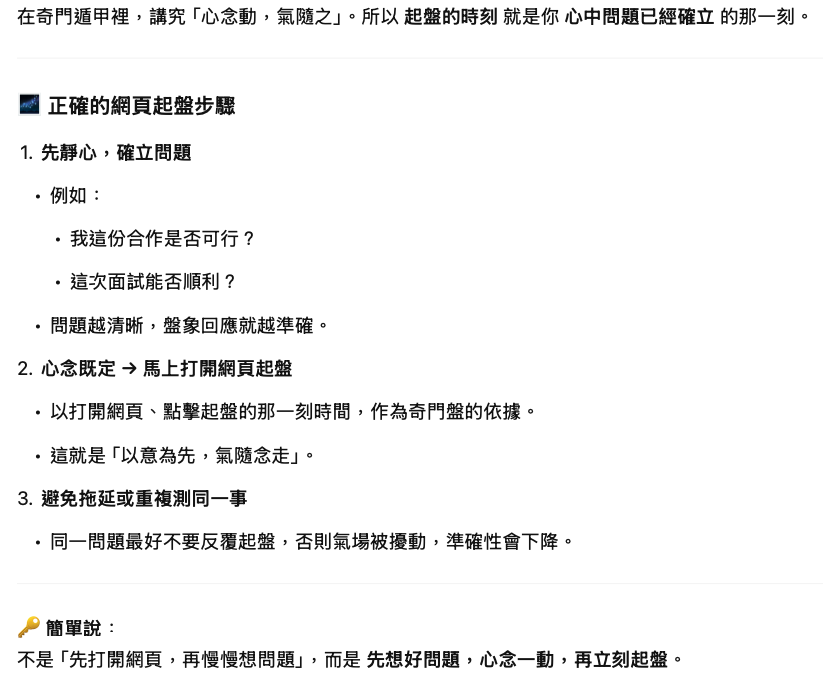

# 奇門遁甲排盤系統

一個基於 Node.js 的奇門遁甲排盤系統，遵循茅山派奇門遁甲排盤方法，支援繁簡體中文和 AI 智能解盤功能。

是先想好問題 再開網頁
https://qi.david888.com


**致謝原作者**：本專案基於 [qfdk/qimen](https://github.com/qfdk/qimen) 進行開發和改進。

## 功能特點

### 🔮 核心功能
- **實時排盤**：根據當前時間自動計算奇門盤
- **自定義排盤**：可選擇任意日期時間進行奇門排盤
- **多種排盤方法**：支援時家、日家、月家、年家奇門
- **多用途分析**：綜合、事業、財運、感情、健康等不同用途
- **時間精度模式**：
  - **傳統模式**：以當下時辰起盤（兩小時一盤）
  - **進階模式**：九宮拆補（13分鐘法），每時辰細分為9段

### 🌸 梅花易數
- **時間起卦**：採用傳統時辰（子時 23:00–00:59 起算）
- **卦象結果**：本卦、互卦、變卦與體用五行分析
- **卦辭/爻辭**：完整 64 卦與 384 爻資料
- **AI 解卦**：支援梅花易數的 AI 分析與外部 API 問答

### 🤖 AI 智能解盤
- **AI 大師解盤**：使用大語言模型進行智能解讀
- **互動問答**：針對排盤結果提出具體問題
- **續問功能**：支援多輪對話，AI 會記住對話脈絡，可深入追問細節
- **清除對話**：一鍵清除對話記錄，開始新的問題
- **多模型支援**：支援 OpenAI、Claude、Groq、通義千問、本地 Ollama 等 [更詳細說明](LLM-INTEGRATION.md)
- **個性化分析**：根據不同用途提供專門建議

### 🌏 多語言支援
- **繁體中文**（預設）
- **簡體中文**
- **語言切換**：一鍵切換介面語言

### 📊 完整信息展示
- **基本資訊**：局數（陰陽遁、上中下元）、四柱、旬首
- **九宮分析**：八門、九星、八神分布
- **地盤資訊**：地支、三奇六儀
- **值符值使**：詳細位置和影響分析
- **吉凶判斷**：各宮位吉凶標記和詳細說明

### 🎨 用戶體驗
- **響應式設計**：適配桌面和手機設備
- **直觀界面**：圖形化九宮格顯示
- **顏色標記**：五行顏色和吉凶標示
- **詳細說明**：包含奇門遁甲基礎知識

## 安裝使用

### 環境要求
- Node.js 14+ 
- pnpm 或 npm

### 快速開始
```bash
# 克隆專案
git clone <repository-url>
cd qimen

# 安裝依賴
pnpm install

# 配置環境變數（可選，用於 AI 功能）
cp .env.example .env
# 編輯 .env 文件，設置 LLM API Key

# 啟動應用
pnpm start
# 或
node app.js

# 訪問應用
# 打開瀏覽器訪問 http://localhost:3000
```

### AI 功能配置

#### OpenAI 配置
```env
LLM_PROVIDER=openai
LLM_API_KEY=sk-xxxxxxxxxxxxxxxxxxxxxxxxxxxxxxxxxxxxxxxx
LLM_MODEL=gpt-4o-mini
```

#### 本地 Ollama 配置（免費）
```env
LLM_PROVIDER=ollama
LLM_API_KEY=not_required
LLM_MODEL=llama3.1:latest
LLM_BASE_URL=http://localhost:11434/v1
```

#### Groq 配置（高速推理）

```env
LLM_PROVIDER=groq
LLM_API_KEY=gsk_xxxxxxxxxxxxxxxxxxxxxxxxxxxxxxxxxxxxxxxx
LLM_MODEL=mixtral-8x7b-32768
```

#### Discord Webhook 配置（可選）
```env
DISCORD_WEBHOOK_URL=https://discord.com/api/webhooks/YOUR_WEBHOOK_ID/YOUR_WEBHOOK_TOKEN
```

## 技術架構

### 後端技術
- **Express.js**：Web 框架
- **lunar-javascript**：農曆和節氣計算
- **EJS**：模板引擎
- **多語言支援**：自建 i18n 系統

### AI 整合
- **LLM 服務**：統一的多提供商接口
- **智能提示詞**：結構化奇門數據轉換
- **錯誤處理**：優雅降級和備用分析

### 前端技術
- **Bootstrap**：響應式 UI 框架
- **jQuery**：DOM 操作和 AJAX
- **CSS3**：現代樣式和動畫

## API 接口

### Web 界面
- `GET /`：主頁面（實時排盤）
- `GET /custom`：自定義排盤
- `GET /start`：靜心起盤頁面
- `GET /meihua`：梅花易數起卦頁面

### LLM AI 分析
- `POST /api/llm-analysis`：AI 解盤分析（支援 `conversationHistory` 參數進行多輪對話）
- `POST /api/meihua/llm-analysis`：梅花易數 AI 解卦
- `GET /api/llm-config`：LLM 配置狀態
- `GET /api/llm-test`：測試 LLM 連接

### 外部 API 調用
- `POST /api/qimen-question`：**奇門問答 API**（供外部系統調用）
- `POST /api/meihua-question`：**梅花易數問答 API**（供外部系統調用）

### Discord 整合
- `GET /api/discord-test`：Discord webhook 測試

### 其他
- `GET /api/qimen`：奇門排盤數據查詢
- `POST /api/meihua/qigua`：梅花易數起卦
- `GET /api/timezone-debug`：時區調試信息

---

## 🚀 外部 API 調用 (v2.0 新功能)

現在您可以通過 API 直接調用奇門問答功能，無需打開網頁界面！

### API 端點
```
POST /api/qimen-question
```

### 請求格式
```json
{
  "question": "今天適合投資嗎？",
  "datetime": "2024-01-01T10:30:00",  // 可選，預設當前時間
  "timezone": "+08:00",               // 可選，預設系統時區
  "mode": "advanced",                 // 可選：traditional/advanced
  "purpose": "事業"                   // 可選：綜合/事業/感情/財運等
}
```

### 回應格式
```json
{
  "success": true,
  "answer": "根據當前奇門盤分析，今日庚金臨震宮...",
  "qimenInfo": {
    "datetime": "2024-01-01T10:30:00.000Z",
    "localDate": "2024/1/1",
    "localTime": "上午10:30:00",
    "mode": "advanced",
    "purpose": "事業"
  },
  "provider": "openai",
  "model": "gpt-4o-mini",
  "timestamp": "2024-01-01T10:30:15.123Z",
  "discordSent": true
}
```

### 使用範例

#### cURL 調用
```bash
curl -X POST http://localhost:3000/api/qimen-question \
  -H "Content-Type: application/json" \
  -d '{
    "question": "今天適合投資嗎？",
    "mode": "advanced",
    "purpose": "財運"
  }'
```

---

## 🌸 梅花易數外部 API

### API 端點
```
POST /api/meihua-question
```

### 請求格式
```json
{
  "question": "今天適合簽約嗎？",
  "method": "time",
  "datetime": "2026-01-20T15:30:00",
  "timezone": "+08:00"
}
```

### 欄位說明
- `question`：必填，使用者問題
- `method`：`time`（時間起卦）或 `numbers`（數字起卦）
- `datetime`：可選，時間起卦的指定時間（ISO 格式），預設為現在
- `timezone`：可選，時區偏移，預設為系統時區（例如 `+08:00`）
- `num1`、`num2`、`num3`：數字起卦用（`method=numbers`）

### cURL 調用
```bash
curl -X POST http://localhost:3000/api/meihua-question \
  -H "Content-Type: application/json" \
  -d '{
    "question": "今天適合簽約嗎？",
    "method": "time",
    "datetime": "2026-01-20T15:30:00",
    "timezone": "+08:00"
  }'
```

#### 數字起卦範例
```bash
curl -X POST http://localhost:3000/api/meihua-question \
  -H "Content-Type: application/json" \
  -d '{
    "question": "這個合作案的結果如何？",
    "method": "numbers",
    "num1": 6,
    "num2": 8,
    "num3": 3
  }'
```

#### JavaScript 調用
```javascript
const response = await fetch('http://localhost:3000/api/qimen-question', {
  method: 'POST',
  headers: {
    'Content-Type': 'application/json'
  },
  body: JSON.stringify({
    question: '今天適合投資嗎？',
    mode: 'advanced',
    purpose: '財運'
  })
});

const result = await response.json();
console.log(result.answer);
```

#### Python 調用
```python
import requests

response = requests.post('http://localhost:3000/api/qimen-question', 
  json={
    'question': '今天適合投資嗎？',
    'mode': 'advanced', 
    'purpose': '財運'
  }
)

result = response.json()
print(result['answer'])
```

### 應用場景
- **聊天機器人**：Line Bot、Discord Bot、Telegram Bot
- **第三方整合**：其他占卜網站、應用程式
- **自動化查詢**：定時獲取每日運勢
- **批量分析**：研究不同時間點的運勢變化

---

## 💬 續問功能說明

AI 問答支援多輪對話，讓您可以深入追問細節：

### 使用方式
1. 輸入第一個問題，AI 回答後會顯示在對話區域
2. 在輸入框繼續輸入續問問題，AI 會記住之前的對話脈絡
3. 點擊 🗑️ 按鈕可清除對話記錄，開始新的問題

### 技術細節
- 對話歷史儲存在瀏覽器端（前端儲存）
- 最多保留 10 輪對話，避免超過 API token 限制
- 重新整理頁面會清空對話記錄

### API 調用續問
```javascript
// 透過 conversationHistory 參數傳遞對話歷史
const response = await fetch('/api/llm-analysis', {
  method: 'POST',
  headers: { 'Content-Type': 'application/json' },
  body: JSON.stringify({
    qimenData: qimenData,
    userQuestion: '可以再詳細說明財運部分嗎？',
    conversationHistory: [
      { role: 'user', content: '今天運勢如何？' },
      { role: 'assistant', content: 'AI 的第一個回答...' }
    ],
    purpose: '綜合',
    lang: 'zh-tw'
  })
});
```

---

## 🔔 Discord Webhook 整合

系統支援 Discord Webhook 整合，可將用戶問題和 AI 解答自動發送到 Discord 頻道。

### 配置 Discord Webhook

1. 在 Discord 伺服器中創建 Webhook：
   - 進入頻道設定 → 整合 → Webhook
   - 點擊「新增 Webhook」
   - 複製 Webhook URL

2. 在 `.env` 文件中配置：
```env
DISCORD_WEBHOOK_URL=https://discord.com/api/webhooks/YOUR_WEBHOOK_ID/YOUR_WEBHOOK_TOKEN
```

### Discord 功能
- **用戶問題通知**：當有人在網頁或 API 提問時，自動發送到 Discord
- **AI 解答記錄**：LLM 的解盤結果也會發送到 Discord
- **來源標記**：區分來自網頁界面或外部 API 的請求
- **格式化顯示**：使用 Discord Embed 格式，美觀易讀

### 測試 Discord 連接
```bash
curl http://localhost:3000/api/discord-test
```

## 專案結構

```text
qimen/
├── app.js                    # 主應用程序
├── data/                     # 資料檔
│   └── meihua/yaoci.md       # 梅花易數卦辭/爻辭
├── lib/                      # 核心庫
│   ├── qimen.js             # 奇門遁甲計算引擎
│   ├── meihua.js            # 梅花易數計算引擎
│   ├── meihua-text.js       # 卦辭/爻辭資料處理
│   ├── llm-analysis.js      # AI 解盤服務
│   ├── discord-webhook.js   # Discord Webhook 整合
│   ├── api-time-handler.js  # API 時間處理工具
│   ├── i18n.js              # 多語言系統
│   └── constants.js         # 常量定義
├── views/                    # 模板文件
├── public/                   # 靜態資源
├── lang/                     # 語言文件
└── .env.example             # 環境變數範例（含 Discord 配置）
```

---

# Qimen Dunjia Divination System

A Node.js-based Qimen Dunjia divination system following the Maoshan school methodology, with Traditional/Simplified Chinese support and AI-powered analysis.

**Credits**: This project is developed based on [qfdk/qimen](https://github.com/qfdk/qimen).

## Features

### 🔮 Core Functions
- **Real-time Divination**: Automatic calculation based on current time
- **Custom Divination**: Choose any date and time for divination
- **Multiple Methods**: Support for Shijia, Rijia, Yuejia, Nianjia Qimen
- **Multi-purpose Analysis**: General, career, wealth, love, health consultations

### 🌸 Meihua Yishu
- **Time-based Qigua**: Uses traditional shichen ranges (Zi hour starts at 23:00)
- **Hexagram Results**: Ben Gua, Hu Gua, Bian Gua, and wuxing analysis
- **Full Text**: Complete 64 gua and 384 yao content
- **AI Reading**: LLM analysis and external API support

### 🤖 AI-Powered Analysis
- **AI Master Reading**: Intelligent interpretation using Large Language Models
- **Interactive Q&A**: Ask specific questions about divination results
- **Multiple AI Models**: Support for OpenAI, Claude, Groq, Qwen, local Ollama
- **Personalized Analysis**: Tailored advice for different purposes

### 🌏 Multi-language Support
- **Traditional Chinese** (default)
- **Simplified Chinese**
- **Language Toggle**: One-click interface switching

### 📊 Comprehensive Display
- **Basic Info**: Bureau numbers, Four Pillars, Xun Shou
- **Nine Palaces**: Eight Gates, Nine Stars, Eight Spirits distribution
- **Earth Plate**: Earthly Branches, Three Wonders and Six Instruments
- **Zhifu Zhishi**: Detailed position and influence analysis
- **Fortune Assessment**: Palace-wise fortune marking and explanations

### 🎨 User Experience
- **Responsive Design**: Desktop and mobile compatibility
- **Intuitive Interface**: Graphical nine-palace grid display
- **Color Coding**: Five-element colors and fortune indicators
- **Detailed Guide**: Qimen Dunjia fundamentals included

## Installation

### Requirements
- Node.js 14+
- pnpm or npm

### Quick Start
```bash
# Clone the project
git clone <repository-url>
cd qimen

# Install dependencies
pnpm install

# Configure environment (optional, for AI features)
cp .env.example .env
# Edit .env file to set LLM API Key

# Start the application
pnpm start
# or
node app.js

# Access the application
# Open browser and visit http://localhost:3000
```

### AI Configuration

#### OpenAI Setup
```env
LLM_PROVIDER=openai
LLM_API_KEY=sk-xxxxxxxxxxxxxxxxxxxxxxxxxxxxxxxxxxxxxxxx
LLM_MODEL=gpt-4o-mini
```

#### Local Ollama Setup (Free)
```env
LLM_PROVIDER=ollama
LLM_API_KEY=not_required
LLM_MODEL=llama3.1:latest
LLM_BASE_URL=http://localhost:11434/v1
```

#### Groq Setup (High-speed Inference)

```env
LLM_PROVIDER=groq
LLM_API_KEY=gsk_xxxxxxxxxxxxxxxxxxxxxxxxxxxxxxxxxxxxxxxx
LLM_MODEL=mixtral-8x7b-32768
```

## Technical Stack

### Backend
- **Express.js**: Web framework
- **lunar-javascript**: Lunar calendar and solar terms calculation
- **EJS**: Template engine
- **i18n System**: Custom multilingual support

### AI Integration
- **LLM Service**: Unified multi-provider interface
- **Smart Prompts**: Structured Qimen data conversion
- **Error Handling**: Graceful fallback and backup analysis

### Frontend
- **Bootstrap**: Responsive UI framework
- **jQuery**: DOM manipulation and AJAX
- **CSS3**: Modern styling and animations

## API Endpoints

- `GET /`: Main page (real-time divination)
- `GET /custom`: Custom divination
- `POST /api/llm-analysis`: AI divination analysis
- `GET /api/llm-config`: LLM configuration status
- `GET /api/llm-test`: Test LLM connection

## Project Structure

```text
qimen/
├── app.js                    # Main application
├── lib/                      # Core libraries
│   ├── qimen.js             # Qimen calculation engine
│   ├── llm-analysis.js      # AI analysis service
│   ├── discord-webhook.js   # Discord Webhook integration
│   ├── api-time-handler.js  # API time handling utility
│   ├── i18n.js              # Multilingual system
│   └── constants.js         # Constants definition
├── mcp/                      # MCP integration
│   └── mcp-bridge.js        # Zero-dependency MCP bridge script
├── skills/                   # LLM Skill definitions
│   ├── qimen-consultant/   # Qimen skill prompt/config
│   │   └── SKILL.md
│   └── meihua-consultant/  # Meihua skill prompt/config
│       └── SKILL.md
├── views/                    # Template files
├── public/                   # Static assets
├── lang/                     # Language files
└── .env.example             # Environment variables example (with Discord config)
```
## 🤖 LLM 整合與代理支援

本專案提供兩種**完全獨立**的方式，讓您的 LLM（如 Claude、Cursor 等）可以存取奇門遁甲與梅花易數的服務。您可以依據您的工作流程選擇最適合的一種：

### 方案一：LLM Skills (獨立技能包)

我們提供標準的 Anthropic `SKILL.md` 技能定​​義。只要將這些技能資料夾提供給您的代理，LLM 就能夠自動閱讀並學習如何成為命理顧問，並直接執行內建的獨立腳本向 `qi.david888.com` 取得盤口資料，而不依賴任何背景服務。

- **奇門專業顧問 (`skills/qimen-consultant/`)**: 專注於高精度的奇門運勢與決策分析。
- **梅花快速起卦 (`skills/meihua-consultant/`)**: 適合快速的決策指引與梅花易數解卦。

每個技能皆內含 `scripts/ask_*.js`，讓 LLM 可以自給自足地呼叫 API，您**不需要**作任何伺服器配置。

### 方案二：MCP Server (背景服務)

如果您偏好讓您的 LLM（如 Claude Desktop）透過 Model Context Protocol 來全局訪問各種工具，您可以使用我們提供的 MCP Server 橋接程式：

- **啟動位置**: `mcp/dist/index.js`

**事前準備**:
在使用前，請進入 `mcp` 資料夾進行安裝與建置：
```bash
cd mcp
npm install
npm run build
```

**設定方法 (以 Claude Desktop 為例)**：
1. 開啟設定檔：`~/Library/Application Support/Claude/claude_desktop_config.json`
2. 加入以下配置（請替換為您的實際路徑）：
```json
{
  "mcpServers": {
    "qimen-meihua": {
      "command": "node",
      "args": ["/Users/david/Documents/git/tbdavid2019/qimen/mcp/dist/index.js"]
    }
  }
}
```
配置後，您的 LLM 將獲得全局的 `qimen_divination` 與 `meihua_divination` 工具，隨時可被呼叫。

