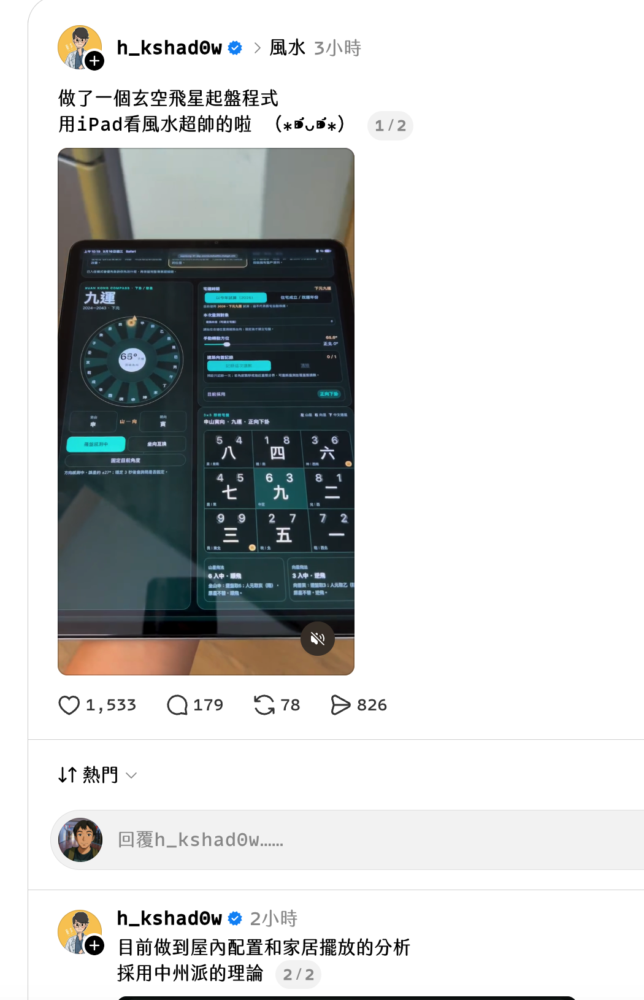
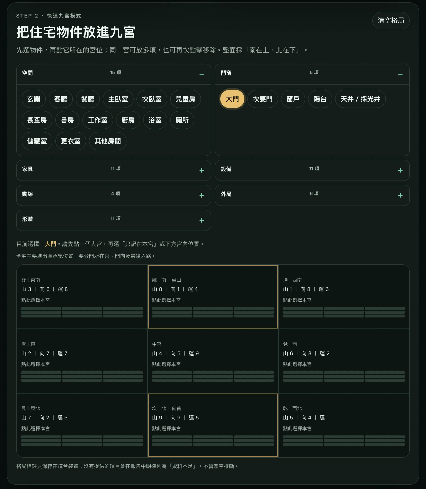

# Proposal: 玄空飛星電子羅盤與中州派九宮物件佈局分析

## 判定與實作門檻

這個 change 在目前的 Node.js、Express 與既有風水排盤架構上可行，但必須先完成資料契約與術法規則定版，才能進入生產實作。電子羅盤是「感測器估計值」，不可在沒有真北校正、替卦資料或實機驗證時宣稱精確定盤。

本 change 採用以下原則：

- 保留既有 `/api/fengshui/report`、`/api/fengshui-question` 與既有輸入格式。
- 新增一個純計算端點 `POST /api/fengshui/evaluate-layout`，只回傳驗證後的盤面與九宮評估，不呼叫 LLM 或 Discord。
- `heading` 是唯一新的角度欄位；`degree` 不作為另一套公開契約。
- `layoutObjects` 使用穩定的 canonical object ID，不直接把自由文字當規則輸入。
- 替卦、經典引文與中州派規則必須進入版本化資料集並附來源；資料未完成前不得進入生產計算路徑。

## 視覺與實例參考


*參考圖一：65° 作為寅向的電子羅盤、坐向判定與九宮盤面。圖片是視覺參考，不是演算法來源。*


*參考圖二：南在上、北在下的九宮物件標註介面。圖片是互動流程參考，不直接決定 API schema。*

## Why

目前 `/fengshui` 主要依賴人工選取八方位或 24 山，且現有報告沒有接受住宅物件在九宮中的實際落位。使用者因此無法把大門、主臥、灶位、衛浴與動線資料帶入同一張盤面。

本 change 將量測、標註與評估分成三個可驗證層次：

```text
手機感測器 / 手動角度
          │
          ▼
heading 正規化 → 24 山 → 下卦/兼向候選/空亡警告
          │
          ▼
layoutObjects + entryPath → 可追溯的規則結果與資料不足清單
```

## What Changes

- 新增跨平台、可降級的手機方向感測器適配層，包含權限、傾角、螢幕旋轉、圓周角度濾波、穩定度與鎖定狀態。
- 新增 24 山角度轉換與坐向推導；輸出測量來源、北向基準、正規化角度、山名、坐山、向首與分類。
- 新增七類住宅物件 catalog，共 63 個 canonical tags，支援九宮疊加、移動、移除、清空與本機快照。
- 新增 `entryPath` 與 `pathQuality`，讓「最後入路」與通暢狀態有明確資料來源，不從無序標籤猜測。
- 新增中州派規則 registry，對門路承氣、動靜分宮、灶位、衛浴、文昌與經典引文輸出 `ruleId`、輸入依據、資料不足與行動建議。
- 同步更新 Web UI、現有 API、純 Node CLI、API 型 Skill、WebMCP、官方 MCP/bridge、README、API docs 與 CHANGELOG。

## Capabilities

### New Capabilities
- `fengshui-compass`: 跨平台電子羅盤感測器適配、24 山度數映射、下卦/兼向候選/大小空亡線判定與坐向鎖定。
- `fengshui-zhongzhou-layout`: 七大類 63 項住宅物件九宮落位標註、入路循跡、資料不足誠實原則與版本化中州派室內理氣評估。

### Modified Capabilities
*(無既有 OpenSpec 規格需變更，本 change 為首次建立風水規格)*

## Compatibility

- 沒有 `heading` 或 `layoutObjects` 的既有請求維持現有 `calculateFengShui` 結果形狀。
- 有效 `heading` 時由系統推導 24 山；若同時提供互相矛盾的 `facing`，回傳結構化 400 錯誤，不靜默覆寫。
- `facing` 仍支援既有八方位與 24 山字串。
- `mode=shaqi` 與 `mode=zeri` 不接受住宅佈局規則欄位，避免跨模式誤用。

## Acceptance Summary

- 24 山中心、山界、小空亡、大空亡、0/360° 與無效角度均有固定測試案例。
- 替卦只在版本化規則資料集與測試完整時輸出；否則輸出「兼向候選，需人工確認」，不產生假的替星盤。
- 未提供大門、灶位、主臥或入路資料時，報告明確列出「資料不足」，不生成對應斷語。
- Node 單元/API/CLI/WebMCP/MCP 測試全部通過，另完成 iOS Safari 與 Android Chrome 實機驗收。
- 參考圖片隨 change 一起納入版本控制後，才可稱為永久資產。

## Impact

- **Web UI**：[`views/fengshui.html`](../../../views/fengshui.html)、新建 `public/js/fengshui.js`、既有 `public/js/divination-suite.js` 與 `public/css/divination-suite.css`。
- **後端**：`app.js`、`lib/fengshui.js`、規則與 catalog 資料集、`lib/llm-analysis.js`。
- **CLI/Skill**：`skills/fengshui-consultant/scripts/fengshui_cli.js`、`ask_fengshui.js`、`SKILL.md`。
- **Agent 整合**：`public/js/webmcp.js`、`mcp/src/tools/divination.ts`、編譯後 `mcp/dist`、`mcp-bridge.js`。
- **品質與文檔**：風水單元測試、路由測試、WebMCP/MCP schema 測試、README、API docs、CHANGELOG。
